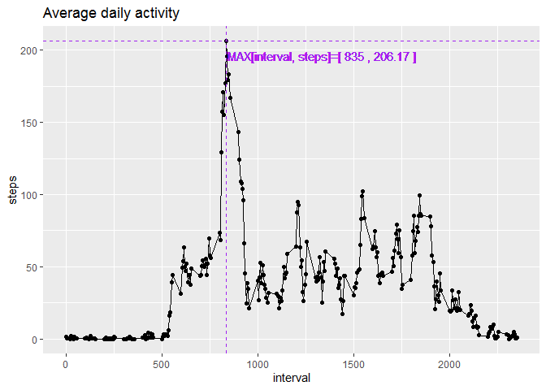

## Loading and preprocessing the data

### Downloading and Extracting the data

```r
file_url <- "https://d396qusza40orc.cloudfront.net/repdata%2Fdata%2Factivity.zip"
file_name <- "./data/repdata_data_activity.zip"
if(!dir.exists("./data")) {dir.create("./data")}
download.file(url = file_url, destfile = file_name, mode = "wb")
unzip(zipfile = file_name, exdir = "./data")
```

### Reading the data

```r
data_file <- "./data/activity.csv"
data_df <- read.csv(file = data_file, stringsAsFactors = FALSE, sep = ",")
data_df$date <- as.Date(data_df$date, format = "%Y-%m-%d")
```


## Imputing missing values

### Checking Quantity of values to be filled


```r
TOTAL_NAs <- sum(!complete.cases(data_df))
paste("number of missing values (NAs) = ", TOTAL_NAs)
```

```
## [1] "number of missing values (NAs) =  2304"
```

## What is mean total number of steps taken per day?


```r
library(dplyr)
```

```
## 
## Attaching package: 'dplyr'
```

```
## The following objects are masked from 'package:stats':
## 
##     filter, lag
```

```
## The following objects are masked from 'package:base':
## 
##     intersect, setdiff, setequal, union
```

```r
library(ggplot2)
total_step_day <- select(.data = data_df, date, steps) %>% group_by(date) %>% 
  summarise_all(.funs = sum, na.rm = TRUE)
total_step_day$interval <- NULL

# Calulating mean and median of the new data set
data_mean <- mean(total_step_day$steps)
data_median <- median(total_step_day$steps) 
print(data_mean)
```

```
## [1] 9354.23
```

```r
print(data_median)
```

```
## [1] 10395
```

```r
# Working on Histogram - Settings 
samples_nbr <- dim(total_step_day)[1]
hist_bins_nbr <- round(sqrt(samples_nbr) , 0)
hist_bins_width <- (max(total_step_day$steps) - min(total_step_day$steps)) / hist_bins_nbr 
colours_vect <- format(total_step_day$date, "%d")

my_plot <- ggplot(data = total_step_day, aes(x = steps, fill = colours_vect)) 
my_plot + geom_histogram(bins = hist_bins_nbr, binwidth = hist_bins_width) + ggtitle(label = "Histogram - Frequency of {Number of Steps / day}") + labs(fill = "By day") + geom_vline(aes(xintercept = data_mean), colour = "blue", linetype = "dashed") + 
geom_text(aes(x=data_mean, label="mean()", y=10), colour="blue", angle=90, vjust = 1.2, text=element_text(size=11)) + 
geom_vline(aes(xintercept = data_median), colour = "green", linetype = "dashed") + 
geom_text(aes(x=data_median, label="median()", y=10), colour="green", angle=90, vjust = 1.2, text=element_text(size=11)) 
```

<!-- -->

## What is the average daily activity pattern?


```r
library(dplyr)
library(ggplot2)
average_step_day <- select(.data = data_df, interval, steps) %>% group_by(interval) %>% 
  summarise_all(.funs = mean, na.rm = TRUE)

my_plot <- ggplot(data = average_step_day, aes(x = interval, y = steps)) 
my_plot + geom_point() + geom_line() + ggtitle(label = "Average daily activity")
```

<!-- -->
  
  *CONCLUSION* There is a visible pattern: people are more active in the beggining of the days than in the end of it (when they are not sleeping).


### Exploratory Data : Analysis - Data Distribution

We pick 4 random dates, to understand how the data was gathered through the whole day, for example: Is each interval is interdependant or not to the other intervals (e.g. each interval is accomulating or not the number of steps)


```r
library(dplyr)
library(ggplot2)
dates_to_explore <- c('2012-10-21', '2012-10-22', '2012-10-23', '2012-10-24')
to_plot <- data_df[data_df$date >= '2012-10-21' & data_df$date <= '2012-10-24', ]

library(ggplot2)
ggplot(data = to_plot, aes(y = steps, x = interval, colour = date)) +
    geom_line() + 
    geom_point() + theme_minimal() +
    facet_grid(rows = vars(date))
```

<!-- -->

As we can observe, each interval is dependant to each other. Besides that we can notice, that a pattern is present depending of the selected interval in a group of days: more or less activity for a group of Interval in different days, like 0 - 500 is almost ZERO, but pikes are more often bettween 1000 - 1200 Intervals.

*So we proceed to group by interval and impute the _NAs_ values with the mean() value for a specific interval* 

### IMPUTING WITH THE MEAN

#### DATA SUMMARY _BEFORE_ IMPUTATION


```r
summary(data_df)
```

```
##      steps             date               interval     
##  Min.   :  0.00   Min.   :2012-10-01   Min.   :   0.0  
##  1st Qu.:  0.00   1st Qu.:2012-10-16   1st Qu.: 588.8  
##  Median :  0.00   Median :2012-10-31   Median :1177.5  
##  Mean   : 37.38   Mean   :2012-10-31   Mean   :1177.5  
##  3rd Qu.: 12.00   3rd Qu.:2012-11-15   3rd Qu.:1766.2  
##  Max.   :806.00   Max.   :2012-11-30   Max.   :2355.0  
##  NA's   :2304
```


```r
library(dplyr)
library(ggplot2)
data_df2 <-   
  group_by(.data = data_df, interval) %>% 
  mutate(steps = ifelse(is.na(steps), mean(steps, na.rm = TRUE), steps))
```

#### DATA SUMMARY _AFTER_ IMPUTATION


```r
summary(data_df2)
```

```
##      steps             date               interval     
##  Min.   :  0.00   Min.   :2012-10-01   Min.   :   0.0  
##  1st Qu.:  0.00   1st Qu.:2012-10-16   1st Qu.: 588.8  
##  Median :  0.00   Median :2012-10-31   Median :1177.5  
##  Mean   : 37.38   Mean   :2012-10-31   Mean   :1177.5  
##  3rd Qu.: 27.00   3rd Qu.:2012-11-15   3rd Qu.:1766.2  
##  Max.   :806.00   Max.   :2012-11-30   Max.   :2355.0
```

After imputation we can be _'glad'_ to see that the mean is kept almost intact meanwhile we use all the NAs values that we were not having before.
  
### After values imputation: What is mean total number of steps taken per day?


```r
library(dplyr)
library(ggplot2)
total_step_day <- select(.data = data_df2, date, steps) %>% group_by(date) %>% 
  summarise_all(.funs = sum)
```

```
## Adding missing grouping variables: `interval`
```

```r
total_step_day$interval <- NULL

# Calulating mean and median of the new data set
data_mean <- mean(total_step_day$steps)
data_median <- median(total_step_day$steps) 
print(data_mean)
```

```
## [1] 10766.19
```

```r
print(data_median)
```

```
## [1] 10766.19
```

```r
# Working on Histogram - Settings 
samples_nbr <- dim(total_step_day)[1]
hist_bins_nbr <- round(sqrt(samples_nbr) , 0)
hist_bins_width <- (max(total_step_day$steps) - min(total_step_day$steps)) / hist_bins_nbr 
colours_vect <- format(total_step_day$date, "%d")

my_plot <- ggplot(data = total_step_day, aes(x = steps, fill = colours_vect)) 
my_plot + geom_histogram(bins = hist_bins_nbr, binwidth = hist_bins_width) + ggtitle(label = "Histogram - Frequency of {Number of Steps / day}") + labs(fill = "By day") + geom_vline(aes(xintercept = data_mean), colour = "blue", linetype = "dashed") + 
geom_text(aes(x=data_mean, label="mean()", y=10), colour="blue", angle=90, vjust = 1.2, text=element_text(size=11)) + 
geom_vline(aes(xintercept = data_median), colour = "green", linetype = "dashed") + 
geom_text(aes(x=data_median, label="median()", y=10), colour="green", angle=90, vjust = 1.2, text=element_text(size=11)) 
```

<!-- -->

*CONCLUSION* After imputation we can se how the mean and median overlap, having a beautiful distribution - mean() is aprox. equal to the median().

## Are there differences in activity patterns between weekdays and weekends?


```r
library(dplyr)
library(ggplot2)
Sys.setlocale("LC_ALL","English")
```

```
## [1] "LC_COLLATE=English_United States.1252;LC_CTYPE=English_United States.1252;LC_MONETARY=English_United States.1252;LC_NUMERIC=C;LC_TIME=English_United States.1252"
```

```r
diff_pattern_week <- mutate(.data = data_df2, weekday = ifelse(weekdays(date) %in% c("Saturday", "Sunday"), "Weekend", "Weekday")) %>% group_by(weekday, interval) %>% select(weekday, interval, steps) %>% summarise_all(.funs = mean)
 
# unique(weekdays(data_df2$date))
# View(diff_pattern_week)
my_plot <- ggplot(data = diff_pattern_week, aes(x = interval, y = steps, colour = weekday))
my_plot <- my_plot + facet_grid(rows=vars(weekday))
my_plot + geom_point() + geom_line() 
```

<!-- -->

*CONCLUSION* Looks like the pattern is different between _weekdays_ and _weekends_: there is a more constant activity during weekends than during weekdays which has a peak in a period of intervals but low activity in the remaining ones. 
